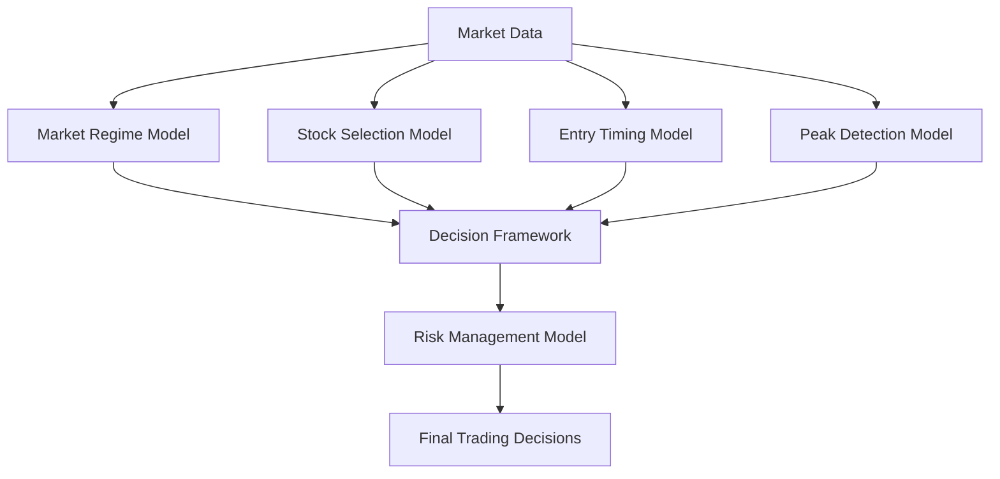

# System Trader Models Documentation

This document provides a comprehensive overview of the machine learning models used in the System Trader platform. Each model serves a specific purpose in the trading workflow, from market regime detection to optimal entry/exit timing and risk management.

## Model Architecture Overview

The System Trader platform employs a multi-model approach where specialized models work together to make trading decisions:

The workflow manager orchestrates the execution of these models in the correct sequence, while the decision framework reconciles potentially conflicting signals to produce coherent trading decisions.

## Market Regime Model

### Purpose
The Market Regime Model identifies the current market state (regime) to adapt trading strategies to changing market conditions.

### Architecture
- **Model Type**: Hybrid model combining Hidden Markov Model (HMM) and XGBoost
- **Input**: Market-wide data including index prices, volatility metrics, and options flow data
- **Output**: Market regime classification with confidence score

### Regimes Identified
1. **Trending Up**: Strong bullish market conditions
2. **Trending Down**: Bearish market conditions
3. **High Volatility**: Choppy market with large price swings
4. **Low Volatility**: Stable market with minimal price movement

### Key Features
- Uses options flow data from Unusual Whales to enhance regime detection
- Implements a two-stage approach: unsupervised HMM for initial regime detection followed by supervised XGBoost for refinement
- Smooths regime transitions to prevent frequent switching
- Calculates transition probabilities between regimes

### Performance Metrics
- Regime stability (average duration of each regime)
- Transition accuracy
- Classification accuracy against labeled regimes

## Stock Selection Model

### Purpose
The Stock Selection Model identifies stocks with high probability of profitable day trading opportunities.

### Architecture
- **Model Type**: XGBoost classifier
- **Input**: Stock-specific features including price action, volume, volatility, and technical indicators
- **Output**: Selection probability for each stock

### Key Features
- Incorporates market regime information to adjust selection criteria
- Uses relative strength vs. market and sector
- Considers liquidity and volatility characteristics
- Employs adaptive thresholds based on market conditions

### Feature Categories
1. **Price Action**: Returns, moving averages, price levels
2. **Volume**: Volume momentum, relative volume, on-balance volume
3. **Volatility**: ATR, Bollinger Bands, historical volatility
4. **Technical**: RSI, MACD, Stochastic, ADX
5. **Market Context**: Beta, correlation with market

### Performance Metrics
- Precision: Percentage of selected stocks that meet profit criteria
- Recall: Percentage of profitable opportunities captured
- F1 Score: Harmonic mean of precision and recall
- ROC AUC: Area under the ROC curve

## Entry Timing Model

### Purpose
The Entry Timing Model determines the optimal time to enter a position for selected stocks.

### Architecture
- **Model Type**: LSTM-Transformer hybrid neural network
- **Input**: Sequence of price and feature data (typically 30 time periods)
- **Output**: Entry signal probability

### Key Features
- Bidirectional LSTM layers capture temporal patterns
- Multi-head attention mechanism focuses on relevant parts of the sequence
- Batch normalization and dropout for regularization
- Trained with binary classification objective (profitable entry vs. non-profitable)

### Feature Categories
1. **Price**: OHLC data
2. **Volume**: Trading volume and related metrics
3. **Technical**: RSI, MACD, Bollinger Bands position, etc.
4. **Orderbook**: Bid-ask spread, depth, and imbalance (when available)

### Performance Metrics
- Accuracy: Percentage of correct entry signals
- Precision: Percentage of entry signals that lead to profitable trades
- Recall: Percentage of profitable opportunities captured
- AUC: Area under the ROC curve
- F1 Score: Harmonic mean of precision and recall

## Peak Detection Model

### Purpose
The Peak Detection Model identifies optimal exit points to maximize profits and minimize drawdowns.

### Architecture
- **Model Type**: CNN-LSTM hybrid neural network
- **Input**: Sequence of price and feature data
- **Output**: Exit signal probability

### Key Features
- Specialized in detecting price exhaustion patterns
- Identifies potential price peaks before significant drawdowns
- Considers volatility and momentum characteristics
- Trained on labeled peak data with forward-looking returns

### Feature Categories
1. **Price**: Price momentum, moving averages, candle patterns
2. **Volume**: Volume spikes, on-balance volume, money flow
3. **Momentum**: RSI, MACD, stochastic oscillator
4. **Volatility**: ATR, Bollinger Bands, Keltner Channels
5. **Pattern**: Candlestick patterns, exhaustion signals, parabolic moves

### Performance Metrics
- Peak detection accuracy
- Average profit captured
- Drawdown avoidance
- False positive rate

## Risk Management Model

### Purpose
The Risk Management Model determines optimal position sizes and manages portfolio risk.

### Architecture
- **Model Type**: XGBoost regressor
- **Input**: Stock characteristics, prediction confidences, and market conditions
- **Output**: Position size recommendations and risk metrics

### Key Features
- Implements enhanced Kelly criterion for position sizing
- Adjusts position sizes based on volatility and liquidity
- Considers correlation between positions for portfolio diversification
- Adapts to market regime for overall risk exposure

### Feature Categories
1. **Volatility**: Historical volatility, ATR, volatility ratios
2. **Liquidity**: Dollar volume, spread, volume volatility
3. **Prediction**: Confidence scores from other models
4. **Market**: Market volatility, correlations, regime
5. **Historical**: Past performance in similar conditions

### Performance Metrics
- Risk-adjusted return (Sharpe ratio)
- Maximum drawdown
- Win/loss ratio
- Profit factor

## Model Optimization

The system includes optimization capabilities for model deployment:

### ONNX Converter
- Converts TensorFlow and XGBoost models to ONNX format
- Provides optimizations for inference speed
- Supports quantization for reduced model size

### GH200 Optimizer
- Specialized optimizations for NVIDIA GH200 GPU architecture
- Leverages tensor cores and large memory capacity
- Implements mixed precision for faster inference
- Provides benchmarking capabilities

## Decision Framework

The Decision Framework reconciles signals from multiple models to produce final trading decisions:

### Signal Priority
- Assigns priorities to different model signals
- Implements weighted combining of signals
- Sets confidence thresholds for signal acceptance

### Conflict Resolution
- Resolves conflicts between entry and exit signals
- Applies market regime veto to entry decisions
- Prioritizes risk management for position sizing

### Adaptive Thresholds
- Adjusts signal thresholds based on market conditions
- Implements dynamic confidence requirements
- Balances precision and recall based on regime

## Workflow Management

The Workflow Manager coordinates the execution of models:

### Execution Order
- Determines model execution sequence based on dependencies
- Handles parallel execution when possible
- Manages data flow between models

### Feature Engineering
- Prepares appropriate features for each model
- Ensures data consistency across the pipeline
- Handles missing data and feature transformations

### Caching and Throttling
- Implements caching for model results
- Applies throttling to prevent excessive computation
- Manages resource allocation for optimal performance
