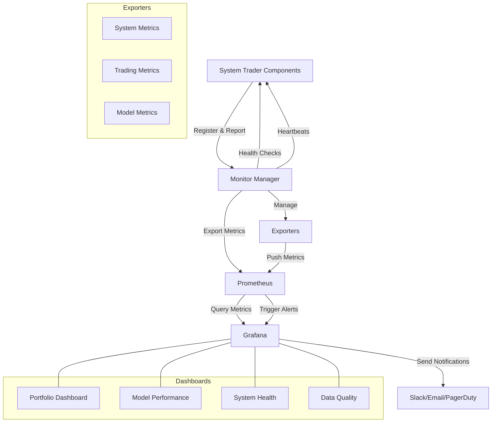

# System Trader Monitoring Documentation

This document provides a comprehensive overview of the monitoring infrastructure used in the System Trader platform. The monitoring system tracks system health, trading performance, model metrics, and data quality to ensure reliable operation and optimal trading outcomes.

## Monitoring Architecture Overview

The System Trader platform employs a robust monitoring stack with Prometheus for metrics collection, Grafana for visualization and alert handling, all coordinated through a centralized Monitor Manager:



The centralized Monitor Manager ensures that all components are properly registered, monitored, and that metrics are collected at appropriate intervals. It provides a unified interface for components to report their health status and metrics.

## Prometheus

### Purpose
Prometheus serves as the central time-series database for storing all metrics. It scrapes metrics from various components, stores them efficiently, and provides a powerful query language (PromQL) for data analysis.

### Configuration
The Prometheus configuration is stored in `config/prometheus/prometheus.yml` and includes:
- Scrape configurations for all exporters
- Job definitions for different metric types
- Retention settings for historical data
- Alert rule file references

### Service Configuration
The Prometheus service is configured in `config/prometheus/prometheus.service` with:
- Systemd unit configuration for automatic startup
- Data storage path configuration
- Web interface settings
- Security hardening options

### Key Features
- Pull-based architecture for reliable metrics collection
- Efficient time-series database optimized for metrics
- Powerful query language (PromQL) for data analysis
- Built-in alerting capabilities
- Service discovery for dynamic environments

## Grafana Alert Management

### Purpose
Grafana handles all alert management directly, including deduplication, grouping, routing, and sending notifications via various channels. This integrated approach simplifies the monitoring stack by eliminating the need for a separate alerting component.

### Configuration
The Grafana alert configuration includes:
- Global settings for SMTP and Slack notifications configured in Grafana
- Alert rules defined directly in Grafana
- Contact points for different notification channels
- Notification policies to route different alert types

### Alert Routing
Alerts are routed based on severity and category:
1. **Critical Alerts**: Sent to the critical team via Slack and PagerDuty
2. **System Alerts**: Routed to the system team
3. **Trading Alerts**: Sent to the trading team
4. **Model Alerts**: Directed to the ML team
5. **Data Alerts**: Routed to the data team

### Notification Policies
The system implements several notification policies to prevent alert storms:
- Component degradation alerts are suppressed when the component is down
- Individual component alerts are inhibited when circuit breakers are triggered
- Order rejection alerts are suppressed during high execution latency

## Grafana

### Purpose
Grafana provides visualization and dashboarding capabilities for metrics stored in Prometheus, enabling real-time monitoring and historical analysis.

### Configuration
Grafana is configured through several files:
- `config/grafana/grafana.ini`: Main configuration file
- `config/grafana/grafana.service`: Systemd service configuration
- `config/grafana/provisioning.yaml`: Provisioning configuration
- `config/grafana/provisioning/datasources/prometheus.yaml`: Prometheus datasource configuration
- `config/grafana/provisioning/alerting`: Alert rules and notification channels configuration

### Dashboards
The system includes several pre-configured dashboards:

#### Portfolio Dashboard
- Real-time portfolio value and performance
- Position tracking with profit/loss visualization
- Risk metrics including drawdown and Sharpe ratio
- Trade history and performance analysis

#### Model Performance Dashboard
- Prediction accuracy metrics for each model
- Confidence score distributions
- Feature importance visualization
- Model latency and resource utilization

#### System Health Dashboard
- CPU, memory, and disk utilization
- Network performance metrics
- Component health status
- Error rates and latency metrics

#### Data Quality Dashboard
- Data freshness metrics
- Validation failure rates
- Collection latency
- Coverage metrics for required data

## Monitor Manager

### Purpose
The Monitor Manager serves as the central coordination point for all monitoring activities in the system. It provides a unified interface for components to register themselves, report their health status, and publish metrics.

### Key Features
- Centralized component registration and health tracking
- Automatic heartbeat monitoring for all registered components
- Standardized metric collection and reporting
- Component health status visualization
- Automatic detection of component failures
- Simplified interface for error reporting and metric recording

### Usage
Components interact with the Monitor Manager through a simple API:
```python
from monitoring import register_component, update_health, record_heartbeat, record_error, record_metric

# Register component with monitoring
register_component('component_name', component_instance)

# Update component health status
update_health('component_name', 'healthy')  # or 'degraded' or 'down'

# Send regular heartbeats
record_heartbeat('component_name')

# Record errors with severity
record_error('component_name', 'error_type', 'critical', 'Error message')

# Record metrics
record_metric('trading', 'metric_name', value, {'label': 'value'})
```

### Health Checks
The Monitor Manager performs regular health checks on all registered components:
- Verifies components are sending regular heartbeats
- Automatically marks components as "down" after missing heartbeats
- Provides health status metrics to Prometheus
- Enables health visualization in Grafana dashboards

## Exporters

The system includes several specialized exporters that collect metrics from different components:

### System Metrics Exporter

#### Purpose
Collects system-level metrics including resource utilization, component health, and operational metrics.

#### Key Metrics
- CPU, memory, and disk utilization
- Network performance
- Component health status
- Error rates and latency
- Service availability

### Trading Metrics Exporter

#### Purpose
Tracks trading performance, execution quality, and portfolio metrics.

#### Key Metrics
- Order execution latency
- Fill rates and slippage
- Portfolio value and returns
- Position metrics
- P&L metrics (realized and unrealized)
- Risk metrics (drawdown, Sharpe ratio, etc.)

### Model Metrics Exporter

#### Purpose
Monitors model performance, prediction quality, and resource utilization.

#### Key Metrics
- Prediction accuracy
- Confidence scores
- Feature importance
- Model latency
- Resource utilization
- Drift detection

## Alert Rules

The system defines several categories of alert rules in `config/prometheus/rules/trading_alerts.yml`:

### System Alerts
- **ComponentDown**: Triggered when a system component is unavailable
- **HighCPUUsage**: Alerts on sustained high CPU utilization
- **HighMemoryUsage**: Triggers on memory pressure
- **DiskSpaceLow**: Warns about low disk space
- **HighLatency**: Alerts on abnormal service latency

### Trading Alerts
- **CircuitBreakerTriggered**: Notifies when a circuit breaker activates
- **HighOrderRejectionRate**: Alerts on excessive order rejections
- **HighExecutionLatency**: Triggers on slow order execution
- **ExcessiveDrawdown**: Warns about portfolio drawdown exceeding thresholds
- **PositionLimitReached**: Notifies when position limits are approached

### Model Alerts
- **ModelPredictionDrift**: Detects shifts in model prediction patterns
- **LowConfidenceScores**: Alerts on declining confidence scores
- **ModelLatencyHigh**: Triggers on slow model inference
- **FeatureDrift**: Detects changes in feature distributions
- **ModelAccuracyDecline**: Warns about declining model performance

### Data Alerts
- **DataCollectionFailure**: Notifies on data collection issues
- **StaleData**: Alerts when data becomes outdated
- **DataValidationFailure**: Triggers on data validation errors
- **IncompleteData**: Warns about incomplete data sets
- **DataQualityLow**: Alerts on poor data quality metrics

## Monitoring Best Practices

### Metric Naming Conventions
- Use consistent naming patterns: `domain_metric_unit`
- Group related metrics with common prefixes
- Use labels for dimensions rather than embedding in metric names

### Alert Design
- Focus on actionable alerts that require human intervention
- Include clear descriptions and suggested remediation steps
- Set appropriate thresholds to minimize false positives
- Use rate-based alerts for transient issues

### Dashboard Organization
- Organize dashboards by functional area
- Include overview panels with key metrics
- Provide drill-down capabilities for detailed analysis
- Use consistent color schemes and visualization types

## Operational Procedures

### Incident Response
1. **Alert Triage**: Assess alert severity and impact
2. **Investigation**: Use dashboards to identify root cause
3. **Mitigation**: Apply appropriate remediation steps
4. **Resolution**: Verify issue is resolved and document findings
5. **Post-mortem**: Analyze incident for process improvements

### Maintenance
- Regularly review alert thresholds for effectiveness
- Update dashboards as system evolves
- Archive historical metrics for long-term analysis
- Periodically test alerting channels

## Integration with Other Systems

### MLflow Integration
- Model performance metrics are exported to both Prometheus and MLflow
- MLflow provides detailed model versioning and experiment tracking
- Grafana dashboards can reference MLflow data for comprehensive views

### Logging Integration
- Centralized logging system with categorized logs (system, models, data, trading, errors)
- Central system log aggregates WARNING and above logs from all components
- Structured logging with JSON-formatted context data for better analysis
- Error logs trigger metrics for monitoring in Prometheus
- Log-based metrics complement direct instrumentation
- Critical log patterns generate alerts in Grafana
- See [Logging Documentation](logging.md) for more details

### Circuit Breaker Integration
- Circuit breaker status is exposed as metrics
- Breaker triggers generate alerts
- Recovery is tracked and visualized

## Future Enhancements

### Planned Improvements
- Anomaly detection for automatic threshold adjustment
- Machine learning-based alert prediction
- Enhanced correlation between metrics for root cause analysis
- Expanded dashboard library for specialized use cases
